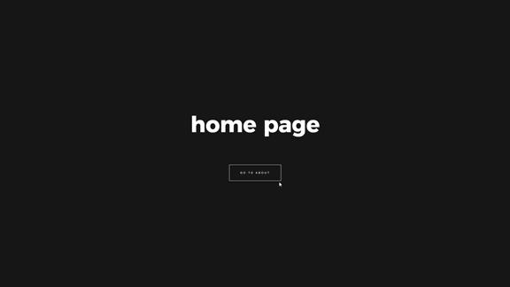

# Page transition with GSAP + Barba JS
Page transition using Sass to stylizing and GSAP + Barba JS to animate.

First time using GSAP and Barba JS library to animate. Also using Sass for the first time.

Based on a tutorial from Codegrid

Final result:

